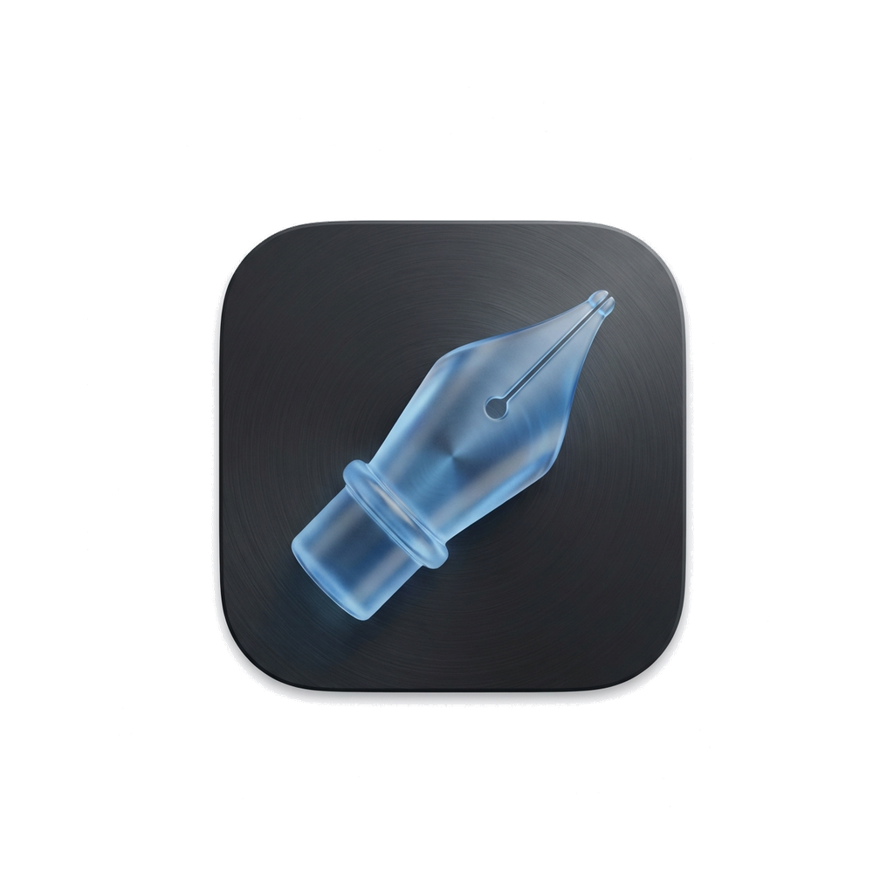

# MDWriter

<p align="center">
  
</p>

<p align="center">
  <b>A professional, native Markdown editor for macOS.</b><br/>
</p>

<p align="center">
  
  
  
  
</p>

---

## 📖 Introduction

**MDWriter** is a native Markdown editor designed for focused writing and efficient organization on macOS. It combines a beautiful, distraction-free writing environment with powerful library management and modern data safety features.

Built with **SwiftUI** and **SwiftData**, MDWriter offers native performance, seamless animations, and a robust database architecture.

## ✨ Features

### ✍️ Professional Editor
*   **Typography First**: Carefully tuned line heights, paragraph spacing, and margins for optimal readability (optimized for both English and Chinese/CJK).
*   **Theme System**: Includes 8 professional themes (Pure, Solarized, GitHub, Dracula, Nord, Monokai, Night Owl) to match your environment.
*   **Typewriter Mode**: Keeps your cursor vertically centered, allowing you to focus on the line you're writing.
*   **MarkX**: A custom regex-based highlighting engine providing accurate, high-performance syntax highlighting without the webview overhead.
*   **Distraction Free**: Hidden title bars and a clean UI let you focus solely on your content.

### 📚 Library & Organization
*   **SwiftData Integration**: A modern, database-driven architecture using SQLite ensures fast search and reliable data integrity.
*   **Three-Column Layout**: Navigate Folders, Document Lists, and the Editor in a fluid, native macOS interface.
*   **Drag & Drop**: Intuitive organization—drag notes between folders, to the Trash, or rearrange your hierarchy.
*   **Smart Lists**: Built-in Inbox and Trash management.

### � Versions & Backups (New in v1.7)
*   **Snapshot History**: Manually save "Versions" of your document and browse them purely visually. View character counts, creation times, and restore previous states with one click.
*   **Full Library Backup**: Export your entire database (Folders, Notes, Snapshots) to a single `.mdwbk` file.
*   **One-Click Restore**: Easily migrate your library to a new machine or recover from accidental data loss.

### 📤 Export & Sharing
*   **PDF Export**: Generate clean, A4-optimized PDFs with styled headers and footers.
*   **Word (RTF)**: Export broad-compatibility Rich Text files.
*   **Standard Markdown**: Your data is yours. Export raw `.md` files at any time.

### 🌍 Localization
*   **Native English Support**
*   **Simplified Chinese (简体中文)**: Fully localized UI, including menus, settings, and tooltips.

## 🚀 Installation

### Download
Download the latest **Universal Binary** (supports both Apple Silicon and Intel) from the [Releases](https://github.com/lpgneg19/MDWriter/releases) page.

## 🛡️ Security & Permissions (macOS Gatekeeper)

Since this application is distributed outside the Mac App Store and is not currently notarized by Apple, you may see a warning saying "MDWriter cannot be opened because it is from an unidentified developer" or "cannot be checked for malicious software."

You can bypass this and run the app using one of the following methods:

### Method 1: Manual (GUI)
1.  Locate **MDWriter.app** in your Applications folder (or wherever you downloaded it).
2.  **Right-click** (or Control-click) the application icon and select **Open**.
3.  A dialog will appear. Click **Open** again to confirm. This only needs to be done once.
4.  *Alternatively*: Go to **System Settings > Privacy & Security**, scroll down to the "Security" section, and click **Open Anyway**.

### Method 2: Command Line (CLI)
If you prefer using the Terminal, you can remove the "quarantine" attribute manually:
```bash
sudo xattr -rd com.apple.quarantine /Applications/MDWriter.app
```

### Build from Source
**Requirements:**
*   macOS 14.0+
*   Xcode 15.0+

1.  Clone the repository:
    ```bash
    git clone https://github.com/lpgneg19/MDWriter.git
    cd MDWriter
    ```
2.  Open `MDWriter.xcodeproj` in Xcode.
3.  Ensure package dependencies (`swift-markdown`) resolve.
4.  Build and Run (`Cmd + R`).

## 📦 Dependencies

MDWriter stands on the shoulders of giants:

*   [swift-markdown](https://github.com/apple/swift-markdown): Apple's robust Markdown parsing library.

## 📄 License

Distributed under the Mozilla Public License 2.0. See `LICENSE` for more information.

---
Built with ❤️ using SwiftUI, SwiftData & AppKit.