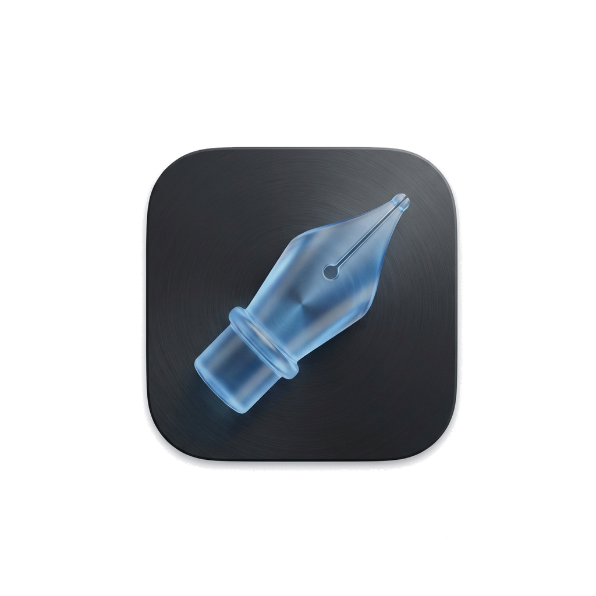

#  MDWriter

<p align="center">
  
</p>

<p align="center">
  <b>A professional, native Markdown editor for macOS.</b><br/>
</p>

<p align="center">
  
  
  
  
</p>

---
[中文版](./README_ZH.md)

MDWriter is a modern, elegant, and powerful Markdown editor for macOS, built with SwiftUI and SwiftData. Inspired by professional writing tools like Ulysses, it provides a focused writing environment with powerful library management, local AI capabilities, and export features.

Built with **SwiftUI** and **SwiftData**, MDWriter offers native performance, seamless animations, and a robust database architecture.

## ✨ Features

### 🧠 Local-First AI & Local LLM Integration (New in v3.0)
*   **Local LLM Support**: Connect to Ollama, LM Studio, oMLX, llama.cpp, MLX, Jan, or custom OpenAI-compatible local engines. Zero cloud data uploads.
*   **AI Chat Panel (`⇧⌘L`)**: Dedicated right sidebar panel for interactive AI conversation with note-bound SwiftData history.
*   **Full Tool Calling**: AI assistant can execute 18 built-in tools to manipulate document selections, manage library notes, edit metadata, format Markdown tables, and register MCP servers.
*   **Model Context Protocol (MCP)**: Powered by `mcp-swift-sdk @ 0.12.1`. Connect local filesystem, web fetchers, Puppeteer, and custom stdio tools with zero-code template presets.
*   **Multi-Engine Privacy Web Search**: Fetch real-time web info via DuckDuckGo (zero API key), SearXNG (self-hosted), Brave, Tavily, Exa, Google, or Bing.
*   **Apple Intelligence Division**: Uses Apple Intelligence for lightweight on-device summaries, title generation, auto-tagging, and fast translation.

### ✍️ Professional Editor
*   **Typography First**: Carefully tuned line heights, paragraph spacing, and margins for optimal readability (optimized for both English and Chinese/CJK).
*   **Theme System**: Includes 8 professional themes (Pure, Solarized, GitHub, Dracula, Nord, Monokai, Night Owl) to match your environment.
*   **Typewriter Mode**: Keeps your cursor vertically centered, allowing you to focus on the line you're writing.
*   **MarkX**: A custom regex-based highlighting engine providing accurate, high-performance syntax highlighting without webview overhead.
*   **Distraction Free**: Hidden title bars and a clean UI let you focus solely on your content.

### 📚 Library & Organization
*   **SwiftData Integration**: Modern SQLite database-driven architecture ensures fast search and reliable data integrity.
*   **Three-Column Layout**: Navigate Folders, Document Lists, and the Editor in a fluid, native macOS interface.
*   **Drag & Drop**: Intuitive organization—drag notes between folders, to the Trash, or rearrange hierarchy.
*   **Smart Lists**: Built-in Inbox and Trash management.

### 📜 Versions & Backups
*   **Snapshot History**: Manually save "Versions" of your document and browse them visually. View character counts, creation times, and restore previous states with one click.
*   **Full Library Backup**: Export your entire database (Folders, Notes, Snapshots) to a single `.mdwbk` file.
*   **One-Click Restore**: Easily migrate your library to a new machine or recover from accidental data loss.

### 📤 Export & Sharing
*   **PDF Export**: Generate clean, A4-optimized PDFs with styled headers and footers.
*   **Word (RTF)**: Export broad-compatibility Rich Text files.
*   **Standard Markdown**: Your data is yours. Export raw `.md` files at any time.

### 🌍 Localization
*   **Native English Support**
*   **Simplified Chinese (简体中文)**: Fully localized UI, including menus, settings, and tooltips.

## 🚀 Installation

### Download
Download the latest **Universal Binary** (supports both Apple Silicon and Intel) from the [Releases](https://github.com/SteveShi/MDWriter/releases) page.

### Homebrew
Install via Homebrew tap:
```bash
brew tap SteveShi/tap
brew install --cask mdwriter
```

### Build from Source
**Requirements:**
*   macOS 14.0+
*   Xcode 16.0+

1.  Clone the repository:
    ```bash
    git clone https://github.com/SteveShi/MDWriter.git
    cd MDWriter
    ```
2.  Generate the Xcode project with Tuist:
    ```bash
    tuist generate
    ```
3.  Open `MDWriter.xcodeproj` in Xcode.
4.  Ensure package dependencies resolve.
5.  Build and Run (`Cmd + R`).


## 📦 Tech Stack

MDWriter leverages several powerful open-source libraries:
- **SwiftUI**: For a modern, native macOS user interface.
- **SwiftData**: For persistent storage and data management.
- **MDEditorKit**: High-performance editor view wrapper.
- **mcp-swift-sdk**: Model Context Protocol client implementation.
- **Sparkle**: For seamless app updates.
- **Tuist**: Declarative Xcode project management.

### Prerequisites
- macOS 14.0 or later
- Xcode 16.0 or later

## License

This project is licensed under the Mozilla Public License Version 2.0 - see the [LICENSE](LICENSE) file for details.
